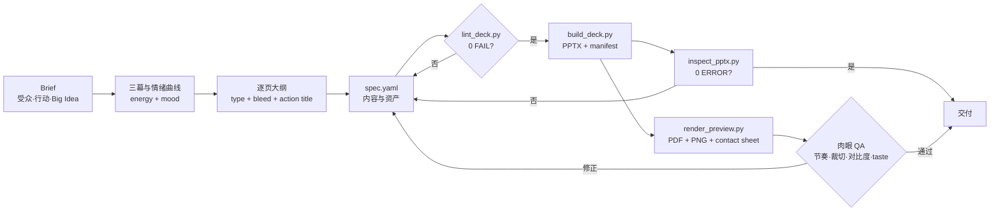
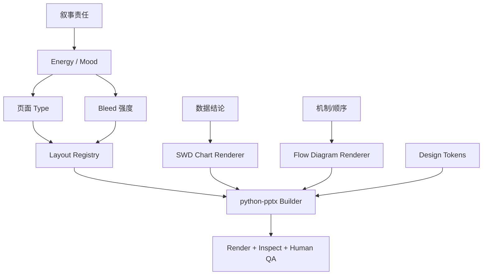

# product-story-pptx

一个面向**产品展示、产品介绍、发布会、解决方案路演与 Demo Day** 的 Agent Skill：先设计故事和情绪曲线，再选择 bleed 版式、流程图、可编辑 UI mockup 和数据视觉，最后通过可执行门禁生成并验证 `.pptx`。既可从零创建，也可继续维护具备 source spec 与 manifest 的同构项目。

它不是通用 PowerPoint 编辑器，也不是“把要点塞进模板”的自动排版器。它专注一个窄目标：

> 把产品讲成一段有蓄力、转折、证明与召唤的故事，并让生成结果可复现、可渲染、可检查。

## 已完成状态

1.2 包含：

- Agent Skills 兼容的 `SKILL.md`。
- Codex/ChatGPT 的 `agents/openai.yaml`。
- 9 份专项设计参考文档 + 调研依据。
- 3 套主题和 10 种 bleed 模式。
- 14 种页面 type。
- Source-backed 多轮迭代、版本 lineage 与回归页规则。
- 可编辑 UI mockup 公共 renderer 与跨实例几何 QA。
- 主题篇幅预算、上下半屏 bleed 与条目专属配图版式。
- Storytelling with Data 风格图表生成器。
- 4 种原生形状流程/架构图。
- Cards 流程支持全覆盖、下置式象形图，并校验结构与资产完整性。
- Spec lint、PPTX inspect、PDF/PNG/contact-sheet 渲染。
- 13 页可运行示例 deck 与合成示例素材。
- 单元测试和全链路 smoke test。

## Skill 结构图

```text
product-story-pptx/
├── SKILL.md                         # 必需：触发边界、工作流、硬规则、资源路由
├── README.md                        # 人类使用说明与结构总览
├── LICENSE
├── requirements.txt
├── agents/
│   └── openai.yaml                  # ChatGPT / Codex 显示信息与默认 prompt
├── references/
│   ├── INDEX.md                     # 按阶段加载的知识索引
│   ├── narrative-arc.md             # Big Idea、三幕、energy/mood
│   ├── bleed-layouts.md             # 10 种 bleed、裁切、scrim
│   ├── layout-system.md             # 画布、type、网格、密度、节奏
│   ├── diagram-patterns.md          # flow/architecture taste
│   ├── data-storytelling.md         # SWD 图表规范
│   ├── visual-language.md           # 主题、字体、色彩、图像
│   ├── qa-checklist.md              # lint + inspect + eyes-on-pixels
│   ├── iteration-lineage.md         # source project、谱系与回归范围
│   ├── editable-ui-mockups.md       # 可编辑 UI 组件与几何 QA
│   └── research-basis.md            # Claude/Codex/GitHub/SWD 调研与取舍
├── assets/
│   ├── design-tokens.yaml           # 主题、字号、scrim、图表 token
│   ├── layout-registry.yaml         # 坐标、type↔bleed、节奏阈值
│   ├── example-deck-spec.yaml       # 字段说明 + 13 页示例 spec
│   └── example-images/              # 合成占位素材，可运行但不得冒充真实产品
├── scripts/
│   ├── lint_deck.py                 # 生成前内容与节奏门禁
│   ├── build_deck.py                # YAML → PPTX + manifest
│   ├── chart_swd.py                 # SWD 风格 bar/hbar/line/slope/dot
│   ├── flow_diagram.py              # cards/chevron/vertical/layers
│   ├── ui_mockup.py                 # 原生形状、可编辑的界面示意
│   ├── render_preview.py            # PPTX/PDF → PNG + contact sheet
│   ├── thumbnail.py                 # render_preview 兼容别名
│   ├── inspect_pptx.py              # 生成后结构门禁
│   └── smoke_test.py                # 全链路回归
├── tests/
│   └── test_lint_rules.py
├── evals/
│   ├── README.md
│   └── evals.json
└── examples/lumen/
    ├── spec.yaml
    ├── assets/
    └── out/
        ├── product-story-pptx-example.pptx
        ├── product-story-pptx-example.manifest.json
        └── product-story-pptx-example_preview/
```

## 工作流结构图



## 设计逻辑



## 为什么不是一份超长 SKILL.md

Agent Skills 采用渐进披露：启动时只加载 name/description，触发后读取 `SKILL.md`，专项资料再按需读取。因此入口文件保持在 500 行以内，图表、流程、bleed 和 QA 分拆到 `references/`，既降低上下文占用，也让规则更容易维护。

## 安装

### OpenAI Codex / ChatGPT desktop

个人级：

```bash
mkdir -p "$HOME/.agents/skills"
cp -R product-story-pptx "$HOME/.agents/skills/product-story-pptx"
```

仓库级：

```bash
mkdir -p .agents/skills
cp -R product-story-pptx .agents/skills/product-story-pptx
```

然后在 Codex 中使用 `$product-story-pptx`，或描述产品发布、产品展示、图文 PPTX、情绪节奏、bleed、SWD 图表等任务让其隐式触发。

### Claude Code

个人级：

```bash
mkdir -p "$HOME/.claude/skills"
cp -R product-story-pptx "$HOME/.claude/skills/product-story-pptx"
```

仓库级：

```bash
mkdir -p .claude/skills
cp -R product-story-pptx .claude/skills/product-story-pptx
```

在 Claude Code 中运行 `/skills` 检查，再用 `/product-story-pptx` 或自然语言触发。文件名必须保持为大写 `SKILL.md`。

## 环境安装

```bash
cd product-story-pptx
python -m pip install -r requirements.txt
```

视觉 QA：

```bash
# macOS
brew install --cask libreoffice
brew install poppler

# Ubuntu / Debian
sudo apt install libreoffice-impress poppler-utils
```

## 5 分钟上手

### 1. 复制示例

```bash
cp -R examples/lumen my-product-deck
rm -rf my-product-deck/out/*
```

### 2. 编辑 spec

重点先改：

```yaml
deck:
  title: ...
  big_idea: ...
  audience: ...
  desired_action: ...
  theme: ink | paper | signal
  assets_dir: ./assets
```

然后逐页改 `type / bleed / energy / mood / title / image / chart / steps`。

继续迭代已有 source project 时，在 `deck.lineage` 中声明父 manifest、版本、变更摘要、回归页与受影响组件，并输出新版本文件；不要覆盖唯一上版。

### 3. 门禁与生成

```bash
python scripts/lint_deck.py my-product-deck/spec.yaml
python scripts/build_deck.py \
  my-product-deck/spec.yaml \
  my-product-deck/out/deck.pptx
```

### 4. 视觉与结构 QA

```bash
python scripts/render_preview.py my-product-deck/out/deck.pptx --dpi 120 --cols 4
python scripts/inspect_pptx.py my-product-deck/out/deck.pptx
```

打开 `my-product-deck/out/deck_preview/contact_sheet.png`，再逐页看 PNG。发现问题回到 spec，不直接拖动生成后的 PPTX。

## 一键回归

```bash
python scripts/smoke_test.py --keep
```

它会检查：

- SKILL frontmatter 与必需文件。
- Python 编译。
- YAML 解析。
- lint 规则单元测试。
- 示例 spec 0 FAIL / 0 WARN。
- PPTX 生成。
- inspect 0 ERROR / 0 WARN。
- Manifest lineage 与主题预算字段。
- LibreOffice/Poppler 渲染 13 页和 contact sheet。

## 示例

- Deck：`examples/lumen/out/product-story-pptx-example.pptx`
- Contact sheet：`examples/lumen/out/product-story-pptx-example_preview/contact_sheet.png`
- Spec：`examples/lumen/spec.yaml`

示例产品、数字、引言与图片均为**虚构或合成演示素材**。它们用于验证布局和脚本，不代表真实产品表现；制作正式 deck 时必须替换。

### 示例节奏

```text
Energy: 4 2 2 3 4 3 4 3 3 4 3 2 5
Bleed:  full / none / none / color-block / half / none /
        half-top / none / none / none / half-bottom / none / full
```

这形成：强承诺 → 低谷 → 数据确认 → 转折 → 能力峰值 → 机制解释 → 可信能力 → 证据 → 数字锚点 → 人的证据 → 新旧对照 → 行动峰值。

## 页面能力

| Type | 主要用途 |
|---|---|
| cover | 开场承诺 |
| section | 章节断点、概念转折 |
| statement | 张力、换气、单一主张 |
| quote | 客户、人或现场证据 |
| feature_hero | 产品能力与截图 |
| split | 图文解释 |
| bullets | 少量原则/收益 |
| compare | 前后、新旧、方案对照 |
| flow | 顺序、机制、架构层级 |
| chart | 数据证据 |
| big_number | 记忆锚点 |
| gallery | 多视角产品图 |
| media_bars | 3–5 个条目与专属图片一一对应 |
| closing | 新常态与 CTA |

## Bleed 能力

| Mode | 视觉作用 |
|---|---|
| none | 安静、理性、证据 |
| full | 强峰值与沉浸 |
| overlay | 复杂图片上的可读解释 |
| partial-left/right | 稳定图文节奏 |
| half | 截图与功能 hero |
| half-top/bottom | 上下半屏场景建立与画面承接 |
| edge | 产品超出画布的力量感 |
| color-block | 无图时的转折与品牌色爆发 |

## 图表能力

支持：

- `bar`
- `hbar`
- `line`
- `slope`
- `dot`
- `big_number`（作为页面 type）

默认规则：去网格、弱化其他数据、最多两项高亮、直接标注、柱状图从 0 开始、source 必填、示例数据角标。

## 流程图能力

- `cards`
- `chevron`
- `vertical`
- `layers`

全部使用 PowerPoint 原生形状，节点可编辑；箭头使用确定坐标的 shape，不使用容易跨渲染器漂移的 connector。

## 关键门禁

- Big Idea、audience、desired action 必填。
- 开场不弱，前 30% 有低谷，末两页有峰值。
- Full + color-block ≤ 40%。
- Full/overlay 有图、有 scrim、图片宽 ≥ 1920px。
- 图表 highlight ≤ 2、source 必填。
- Flow 3–7 节点且恰好一个高亮。
- 连续图表 ≤ 2。
- 最后一页为 closing + CTA。

完整规则见 `SKILL.md` 与 `references/`。

## 技术取舍

### 当前图表是 PNG

Matplotlib 可以稳定实现直接标注、灰底一色强调和来源脚注，但 PowerPoint 中不能直接编辑数据。修改图表应编辑 YAML 后重建。需要业务人员在 PowerPoint 内编辑数据时，可在未来增加 native chart backend。

### 修改既有模板不在范围内

模板填充涉及母版、占位符、品牌资产与 OOXML 保真，应使用通用 PPTX 编辑 skill。这个 skill 专注从零创建产品故事 deck，或继续维护具备 spec、脚本与 manifest 的可重建项目。

### 文本溢出仍需看图

脚本有估算与 inspect，但不同机器字体替换会改变字宽。最终必须看 LibreOffice/PowerPoint 实际渲染。

## 调研来源

完整比较、GitHub 热度快照、许可边界与设计决策见：

- `references/research-basis.md`

主要来源包括 Agent Skills specification、OpenAI Codex skill 文档、Anthropic skills/PPTX skill、frontend-slides、guizang-ppt-skill、academic-pptx-skill、slides_maker、Mck-ppt-design-skill、Storytelling with Data 与 Duarte。

## 维护原则

1. 能机器判断的规则进入 lint/inspect。
2. 全局尺寸与颜色进入 YAML，不散落代码。
3. 新增 type 时同步更新 spec、registry、builder、lint、示例和测试。
4. Pattern 级问题写回 reference 或 gate，不只留在一次对话里。
5. 未看渲染图，不得交付。
